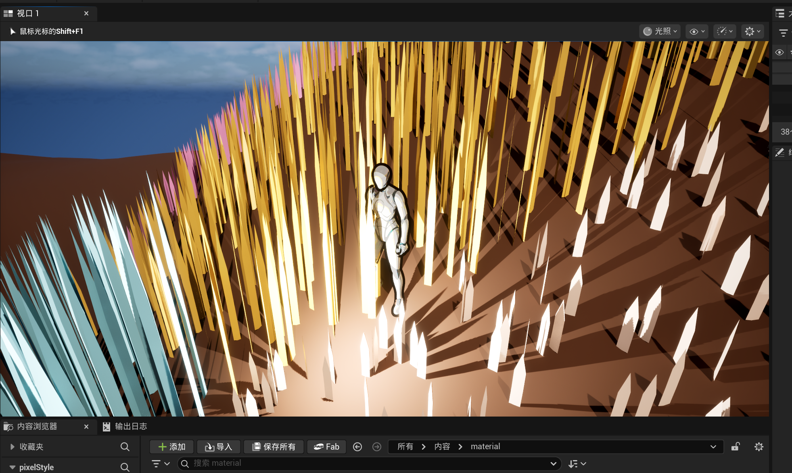
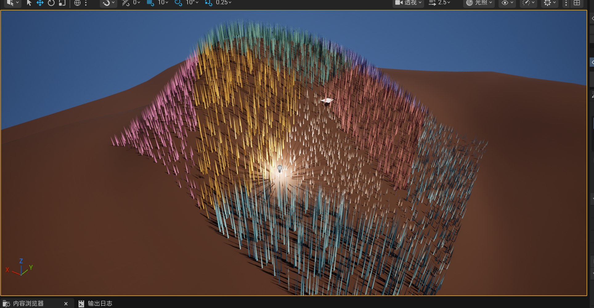

# PcgGrass

基于 Unreal Engine 5.7 的程序化草地插件。  
插件提供 `UProceduralGrassComponent`，用于生成草簇（clumps）和草实例（instances），并同步到 `UHierarchicalInstancedStaticMeshComponent`（HISM）进行渲染。

## 1. 演示

\
\

## 2. 功能概览

- 运行时按分布参数生成草实例（支持可复现随机种子）
- 自动或手动同步实例到 HISM
- 支持两种刀片网格来源：
  - 使用外部指定 `BladeMesh`
  - 未指定时按 `RenderGrassLOD` 运行时构建刀片网格（LOD0/1/2）
- 支持通过 `PerInstanceCustomData` 向材质传递高度/宽度/颜色/风参数等数据 (同簇内参数共享)

## 3. 环境要求

- Unreal Engine: `5.7`
- 插件类型: Runtime

## 4. 安装

1. 将插件放入项目目录：`Plugins/PcgGrass`
2. 重新生成项目文件并编译
3. 在编辑器中启用插件（如未自动启用）

## 5. 快速开始

### 5.1 添加组件

1. 在蓝图或 C++ Actor 中添加 `UProceduralGrassComponent`
2. 设置 `GrassPCG` 内的参数

### 5.2 运行方式

- 自动生成：启用 `bAutoGenerateOnBeginPlay`（运行时）或 `bEditorGenerateOnRegisterIfEmpty`（编辑期）
- 手动更新：
  1. 点击 `UProceduralGrassComponent` 中的 `Generate Grass` 按钮
  2. 调用 `GenerateGrassDistribution()`
